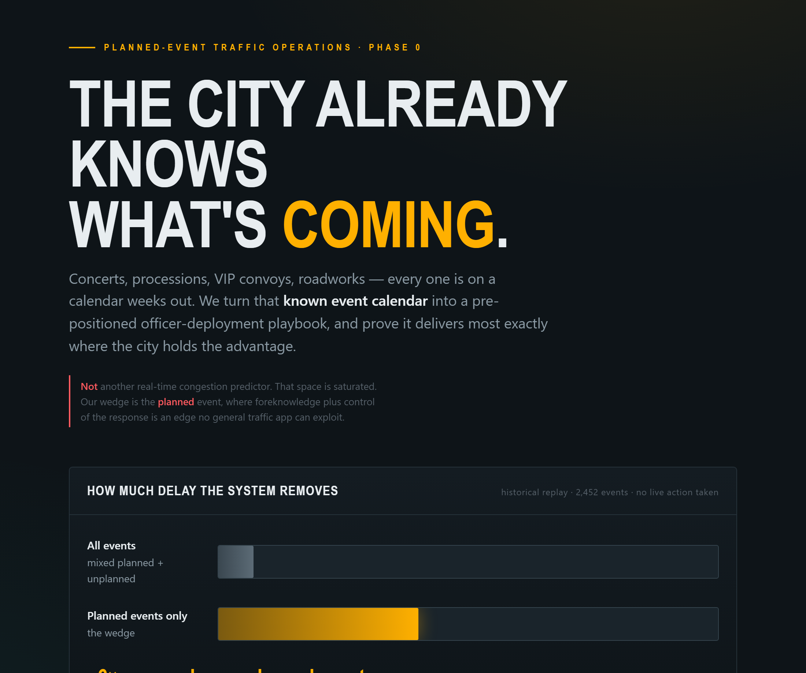

# 🚦 Event-Driven Congestion

### A planned-event traffic-operations system

> Every city already knows when the next concert, procession, VIP convoy, or
> roadwork is coming — it's on a calendar weeks out. This project turns a city's
> **known event calendar** into coordinated, pre-positioned operational playbooks
> spanning traffic police, road agencies, and event organizers — and proves with
> real data that it delivers most exactly where the city holds the advantage.

> **The system is designed as a decision-support platform for traffic management
> centers, not as an autonomous traffic-control system.** Every recommendation is
> reviewed and overridable by the duty engineer.

**This is deliberately *not* another real-time congestion predictor.** That space
is saturated and commoditized. The wedge here is the **planned event**, where the
agency has two things a general traffic app never will: *foreknowledge* (the event
calendar) and *control of the response* (officers, closures, signal timing) days
in advance.

### 🔗 Live demo: **https://ashwinrajan-159.github.io/CrowdWise/**

Click through the pitch, the operator dashboard, and a deployment plan generated
for upcoming events the model has never seen — no install needed.

📐 Full rationale: [DESIGN.md](DESIGN.md) · 📊 Results & honest caveats: [RESULTS.md](RESULTS.md)

---

<table>
<tr>
<td width="50%"><a href="artifacts/pitch.html"></a><p align="center"><sub><b>The pitch</b> — <a href="artifacts/pitch.html">pitch.html</a></sub></p></td>
<td width="50%"><a href="artifacts/operator_view.html"></a><p align="center"><sub><b>The operator dashboard</b> — <a href="artifacts/operator_view.html">operator_view.html</a></sub></p></td>
</tr>
</table>

---

## How it works — at a glance

```
┌─────────────────────┐
│   Event Calendar    │   known days/weeks ahead
└──────────┬──────────┘
           ↓
┌─────────────────────┐
│ Feature Engineering │   time, space, event-type, concurrency
└──────────┬──────────┘
           ↓
┌─────────────────────┐
│ GBM + Analog Engine │   LightGBM forecast + similar past events
└──────────┬──────────┘
           ↓
┌─────────────────────┐
│  Traffic Forecast   │   predicted delay × population exposure
└──────────┬──────────┘
           ↓
┌─────────────────────┐
│ Playbook Generator  │   ranked chokepoints + officer allocation
└──────────┬──────────┘
           ↓
┌─────────────────────┐
│ Historical Replay   │   score the playbook on un-intervened history
└──────────┬──────────┘
           ↓
┌─────────────────────┐
│   KPI Evaluation    │   measure lift vs. doing nothing
└─────────────────────┘
```

---

## The headline result

Validated by historical replay on the **Bengaluru Traffic Police "Astram" event
log** — 8,173 real events, 467 planned, over 5 months:

| Slice | System reduces vehicle-hours of delay by |
|---|---|
| Across all events | **+4.1%** |
| **On planned events only** | **+23.3%** |

**~6× more value on planned events.** Same model, same fixed officer pool —
pointed where the city has foreknowledge it controls. That is the wedge, quantified.

---

## The problem

Cities already know about many disruptive events — concerts, festivals,
processions, VIP movements, and roadworks — days or weeks before they occur. Yet
traffic management for these events remains largely experience-driven, leading to
inconsistent deployments, avoidable congestion, and loss of institutional
knowledge when a veteran officer retires.

The core gap: **cities cannot reliably estimate the traffic impact of upcoming
events**, so they cannot pre-position resources with confidence. Foreknowledge
exists; the system to act on it does not.

## Why it matters

- ⏱️ **Faster network clearance** after events
- 🚗 **Reduced vehicle-hours of delay** for the public
- 👮 **Better utilization** of limited traffic personnel
- 🧠 **Preservation of expert traffic-engineer knowledge** — captured in playbooks, not lost when people leave
- 🤝 **Improved coordination** between police, road agencies, transit, and event organizers

---

## Why is there a "Phase 0"?

The hardest problem in any system that *acts* on traffic predictions is the
**lost-ground-truth problem**:

> If the system predicts a jam, an officer reroutes traffic, and the jam never
> appears — *was the forecast wrong, or did the action prevent it?* You can't
> tell. Worse, you've just logged "predicted jam → no jam" as training data,
> teaching the model the situation was fine — when it was only fine *because you
> intervened*. **Acting on a prediction destroys your own ground truth and poisons
> your training set.** A naive system gets *worse* the more it's trusted.

So you cannot honestly validate this kind of system by deploying it and watching.
The cheapest, cleanest validation is to **replay history** — take past events,
generate the playbook the system *would have* recommended, and score it against
what actually happened. No live action is taken, so ground truth stays
uncontaminated.

**Phase 0 is that historical replay.** It's the first stage of a staged roadmap
precisely because it's the cheapest way to prove (or kill) the core thesis before
spending on live integration:

| Phase | What it adds | Status |
|---|---|---|
| **Phase 0 — Historical replay** | Ingest the event log, train the model, replay past events, measure lift on un-intervened history. **Proves the wedge.** | ✅ **This repo** |
| Phase 1 — Shadow mode | Live data in, recommendations logged, operators run their own plans → clean baseline + causal effect estimates | planned |
| Phase 2 — Staggered live rollout | Randomized held-out events, synthetic controls, real probe/connected-vehicle feed | planned |
| Phase 3 — Digital twin (one venue) | Microsimulation for high-stakes closure scenarios | deferred |

Building Phase 0 first means the expensive phases only happen if the cheap one
says the idea works. It does — see the result above.

---

## How it works — in detail

The pipeline is one straight line — train on history, generate the playbook,
replay it, measure whether it helped. The module map below expands the
at-a-glance diagram up top:

```
ingest → features → target → analogs → model → playbook → replay → lift
```

| Stage | Module | What it does |
|---|---|---|
| **Ingest** | [gridlock/ingest.py](gridlock/ingest.py) | Loads the event log, validates rows, **quarantines** dirty data (bad coords, missing timestamps) instead of silently dropping it |
| **Features** | [gridlock/features.py](gridlock/features.py) | Cyclical time encodings, spatial/corridor flags, event-type flags, event concurrency |
| **Target** | [gridlock/targets.py](gridlock/targets.py) | `TargetProvider` interface: real **censored-duration** target + a **synthetic-delay** target. A real probe feed drops in here as a third provider with zero downstream change |
| **Analogs** | [gridlock/analogs.py](gridlock/analogs.py) | Retrieves the most similar past events — the **auditable explanation surface** ("here are the 5 events behind this call") |
| **Model** | [gridlock/model.py](gridlock/model.py) | LightGBM gradient-boosted baseline + a confidence-weighted analog blend |
| **Playbook** | [gridlock/playbook.py](gridlock/playbook.py) | Ranks chokepoints by `predicted delay × population exposure`, allocates the officer pool, supports operator override |
| **Replay** | [gridlock/replay.py](gridlock/replay.py) | Builds the predicted / acted / observed log and computes the KPI hierarchy |
| **Lift** | [gridlock/lift.py](gridlock/lift.py) | System vs. baselines (do-nothing / uniform) — *does it actually help?* |
| **Walk-forward** | [gridlock/walkforward.py](gridlock/walkforward.py) | Retrains month-by-month as history grows, to test stability over time |
| **Runner** | [run_phase0.py](run_phase0.py) | Ties it all together and writes the artifacts |

**A design choice worth calling out:** forecast accuracy (MAE/RMSE) is treated as
a *diagnostic, not the goal*. Nobody in a control room cares about RMSE — they care
about clearance time and vehicle-hours of delay. The KPI hierarchy reflects that.

---

## Tech stack — and why

Deliberately boring and commodity. The thesis is that the *coordination layer* is
the hard part, not the model — so the model stack is chosen for reliability and
explainability, not novelty.

| Tool | Version | Used for | Why this one |
|---|---|---|---|
| **Python** | 3.11+ | everything | Standard for data/ML pipelines |
| **pandas** | 2.3.3 | ingest, feature engineering, the whole data flow | The default for tabular event data |
| **NumPy** | 2.3.3 | numerical ops under the hood | Pandas/scikit foundation |
| **LightGBM** | 4.6.0 | the gradient-boosted forecast model | Fast, handles missing values *natively* (the event log is full of NULLs), and is **explainable enough for an operations center to trust** — a binding design constraint. No deep learning: a GNN was explicitly gated behind beating this baseline *and* having sensor density, neither of which is met |
| **scikit-learn** | 1.6.1 | metrics, splitting, utility transforms | Standard companion to a GBM workflow |
| **pytest** | — | the 12-test suite that pins pipeline invariants | Catches regressions (already caught a real censoring bug) |

> **No GNN, no optimizer zoo, no microsimulation.** Model simplicity is a feature
> here, not a limitation — see DESIGN.md for why each was deliberately deferred or
> rejected. The operator-facing views ([operator_view.html](artifacts/operator_view.html),
> [pitch.html](artifacts/pitch.html)) are self-contained HTML/CSS/JS with zero
> dependencies.

---

## Steps to run

**1. Install dependencies** (Python 3.11+):

```bash
pip install -r requirements.txt
```

**2. Run the replay.** The anonymized event log ships with the repo, so it works
on clone with no setup:

```bash
# Default: real censored-duration target
python run_phase0.py

# Synthetic-delay target — demonstrates the full north-star KPI loop
python run_phase0.py --target synthetic

# Both targets, writes both sets of artifacts
python run_phase0.py --target both

# The wedge result: evaluate on planned events only (this is the +23.3%)
python run_phase0.py --planned-only

# Walk-forward: retrain each month as history grows, to test stability
python run_phase0.py --walk-forward
```

**3. Check the outputs.** Artifacts land in `artifacts/`:
- `replay_log_<target>.csv` — the predicted / acted / observed triple per event
- `summary_<target>.json` — KPIs plus run metadata

**4. (Optional) Auto-fill the events file from the web.** A scraper pulls
upcoming public events, geocodes each to a location, and writes the CSV the
pipeline consumes. If the live scrape fails (offline, site changed, rate-limited),
it falls back to a bundled cached sample so it never breaks:

```bash
python scrape_events.py --run         # scrape -> upcoming_events.csv -> predict
python scrape_events.py --offline     # use the bundled cached sample (no network)
```

> This scrapes the *event calendar* (what's coming) — **not** live traffic. Real-
> time congestion data is a connected-vehicle/probe feed, which is a Phase-2
> integration that drops into the pipeline's `TargetProvider` seam. It's
> deliberately out of scope: acting on a continuous live prediction reintroduces
> the [lost-ground-truth problem](#why-is-there-a-phase-0), which is exactly what
> the replay-first design avoids.

**5. Predict on a new / upcoming events file.** This is the forward-looking
mode — hand it a calendar of events that *haven't happened yet* (a sample ships
with the repo) and it forecasts the chokepoints and writes a deployment dashboard
for them:

```bash
python predict.py upcoming_events.csv
# trains on all history, forecasts the new events, writes
# artifacts/operator_view_upcoming.html
```

> A future event needs no outcome column — the outcome is exactly what's
> predicted. Every input the model uses (cause, location, time, priority) is known
> before a planned event happens. No accuracy number is produced here, because
> future events have nothing to score against yet (the [lost-ground-truth
> problem](#why-is-there-a-phase-0)) — accuracy is validated on history in step 2.

**6. Run the tests:**

```bash
pytest -q          # 12 tests pinning pipeline behavior
```

**7. See the operator view.** Open [artifacts/operator_view.html](artifacts/operator_view.html)
in a browser — the **Deployment Ledger** for 17 Mar 2024. It shows the model's
most striking real call: 10 of 12 officers sent to a late-night VIP convoy down
Mysore Road known days ahead, each recommendation auditable down to the five past
events behind it, and every assignment overridable by the duty engineer. (Step 4
generates the same dashboard for *your* file.)

---

## Run the web app (full stack)

The `app/` package is a FastAPI backend + a single-page frontend with a **live map**
of where congestion will occur, **CSV upload**, and a **scheduled refresh** that
re-scrapes upcoming events and re-forecasts.

```bash
pip install -r requirements.txt           # includes fastapi, uvicorn, apscheduler

# optional: live event data from PredictHQ (works on the bundled sample without it)
export PREDICTHQ_TOKEN=your_token         # Windows: $env:PREDICTHQ_TOKEN="your_token"

uvicorn app.main:app --reload             # then open http://127.0.0.1:8000
```

What you get at `http://127.0.0.1:8000`:
- A **Leaflet map** of chokepoints as pins, colored on a **green → amber → red
  severity ramp** (closures forced red); events at the same venue fan out so each
  is clickable.
- The ranked **deployment ledger** beside it — each row shows a **severity progress
  bar** (fills + colors by severity) next to the score; click a chokepoint for the
  past events behind the forecast and an officer-override stepper.
- **Upload event CSV** — drop in any event calendar (the required columns are
  `id, event_type, event_cause, latitude, longitude, start_datetime`) and the map +
  ledger re-render for it.
- **Refresh forecast** — re-scrapes upcoming events (PredictHQ, or the bundled sample)
  and re-forecasts. This updates **event forecasts, not live traffic** — a real
  connected-vehicle feed is the designed-for next phase.

**New events / new dates.** The forecast is not tied to a fixed date — any event the
app receives (uploaded or scraped) is forecast and plotted, including future dates.
The model predicts from *patterns* (cause, hour-of-day, day-of-year, corridor) learned
on the historical window, so it generalises to new dates.

**Retrain as history grows.** Scraped/seen events are accumulated; once an event's date
has passed it becomes extra *training history*. `POST /api/retrain` (and a daily
scheduler job) refits the model on the original log + those newly-passed events — the
"improves with each event cycle" loop. Refit is ~1–2s and swaps the cached model
atomically. **Important boundary:** this grows the *event history* it learns from; it
does **not** learn from acted-upon traffic *outcomes* — that would hit the
[lost-ground-truth problem](#why-is-there-a-phase-0) and needs shadow-mode evaluation
(Phase 2).

API: `GET /api/events/current`, `POST /api/predict` (multipart CSV), `POST /api/scrape`,
`POST /api/retrain`, `GET /api/health`.

**Deploy (Render):** the repo ships [render.yaml](render.yaml), a [Procfile](Procfile),
and [.env.example](.env.example). Connect the repo on Render, set `PREDICTHQ_TOKEN` as a
secret, and deploy. Note: free-tier services sleep when idle (≈5–10s cold start on the
next request) and the in-process scheduler pauses while asleep — `render.yaml` documents
an optional cron that keeps the forecast refreshing.

---

## Repo layout

```
.
├── README.md              ← you are here
├── DESIGN.md              ← full design doc: thesis, principles, roadmap, risks
├── RESULTS.md             ← the wedge proof + honest caveats
├── run_phase0.py          ← end-to-end runner: validate on history (the entry point)
├── predict.py             ← forward prediction: chokepoints for a NEW events file
├── scrape_events.py       ← fetch upcoming events (PredictHQ API + cached fallback)
├── events_cache.json      ← bundled fallback events (keeps the scraper demo alive)
├── requirements.txt
├── render.yaml · Procfile · .env.example   ← web-app deploy config (Render)
├── astram_event_data_anonymized.csv   ← the real (anonymized) event log
├── upcoming_events.csv    ← sample 'future' events for predict.py
├── gridlock/              ← the pipeline package (10 modules, see table above)
├── app/                   ← the web app (FastAPI backend + Leaflet/upload frontend)
│   ├── main.py · pipeline.py · cache.py · scheduler.py · config.py
│   └── static/            ← index.html · app.css · app.js (the SPA)
├── tests/                 ← pytest suite (12 tests)
├── images/                ← README screenshots
├── artifacts/             ← canonical dashboards + generated run outputs
│   ├── operator_view.html          ← the Deployment Ledger (operator-facing playbook)
│   ├── operator_view_scraped.html  ← plan generated from scraped upcoming events
│   └── pitch.html                  ← single-page visual story of the project
└── docs/                  ← published web mirror, served live by GitHub Pages
    └── index.html …                (the https://ashwinrajan-159.github.io/CrowdWise/ site)
```

---

## Honest about the limits

A credible project names its weak spots. These are surfaced, not buried — Phase 0
exists to find them cheaply. Full detail in [RESULTS.md](RESULTS.md):

- The **+23.3% is a replay counterfactual**, not a measured field trial. A real
  connected-vehicle feed plus quasi-experimental evaluation is the honest next step.
- The source log has **no native speed/volume** data — delay-hours use a
  duration/synthetic proxy × exposure. The `TargetProvider` seam exists exactly so
  a real feed replaces the proxy cleanly.
- **Real event durations are heavily censored** (only a fraction resolve), so
  real-target MAE is large and honestly reported as a diagnostic.
- **Historical analogs add no point-prediction lift** here (the GBM already learns
  the same signal), so they're kept for explanation and uncertainty — their real job.
