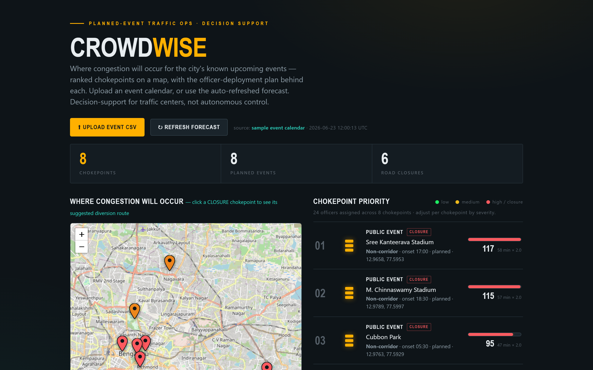

# 🚦 CrowdWise — Event-Driven Congestion

A traffic-operations system that turns a city's **known event calendar** —
concerts, processions, VIP movements, roadworks — into a pre-positioned
officer-deployment plan, shown on a live map. **Decision-support for traffic
control centers, not autonomous control.**

> **Not another real-time congestion predictor** (a saturated space). The wedge
> is the **planned event**, where the agency has two advantages no general traffic
> app does: *foreknowledge* (the calendar) and *control of the response* (officers,
> closures, signals) days ahead.

🔗 **Live app: https://crowdwise-hvto.onrender.com**
📐 [DESIGN.md](DESIGN.md) · 📊 [RESULTS.md](RESULTS.md)



---

## The result that matters

Validated by historical replay on the Bengaluru Traffic Police "Astram" event
log — 8,173 real events, 467 planned, over 5 months:

| Slice | System reduces vehicle-hours of delay by |
|---|---|
| All events | **+4.1%** |
| **Planned events only** | **+23.3%** |

**~6× more value on planned events** — the wedge, quantified. Same model, same
fixed officer pool, pointed where the city has foreknowledge it controls.

---

## What it does

```
Event calendar  →  Forecast  →  Ranked chokepoints  →  Officer plan  →  Map + ledger
  (API/CSV)         (GBM +        (delay × exposure)     (allocation)     (review +
                  analogs)                                                 override)
```

- **Live map** of where congestion will occur — pins colored green→amber→red by
  severity (red = closure), clustered events fanned out.
- **Ranked deployment ledger** — each chokepoint shows a severity bar, the officer
  allocation, the five past events behind the forecast, and an override stepper.
- **Upload a CSV** of events, or let it **auto-scrape** upcoming events (PredictHQ)
  and re-forecast on a schedule.
- **Retrains as event history grows** — past events accumulate into training data
  (`POST /api/retrain`). It grows the history it learns from; it does *not* learn
  from acted-upon outcomes (see the boundary below).

---

## How this maps to the problem statement

> *Event-Driven Congestion (Planned & Unplanned): forecast event-related traffic
> impact and recommend optimal manpower, barricading, and diversion plans, using
> historical and real-time data.*

| Problem statement asks for | CrowdWise | |
|---|---|---|
| Rallies, festivals, sports, construction, gatherings | Event causes: `vip_movement`, `public_event`, `construction`, `procession`, `protest` | ✅ |
| **Quantify event impact in advance** | Per-event severity forecast (delay × exposure), days ahead | ✅ |
| **Resource deployment** (not experience-driven) | Per-chokepoint **manpower** recommendation by severity | ✅ |
| **Barricading** plan | Closure flag + barricade guidance per chokepoint | ✅ |
| **Diversion** plan | Reroute guidance per closure chokepoint (corridor-aware) | ✅ |
| **Post-event learning system** | Retrain-as-history-grows loop (`/api/retrain`) | ✅ |
| **Historical data** | 8,173-event Astram log; trained model | ✅ |
| **Real-time data** | Live PredictHQ event feed, scheduled refresh | ◑ events real-time; live *traffic* feed is Phase 2 |

Two honest boundaries (both deliberate, both documented): live *traffic-speed* data
(vs. event data) and turn-by-turn *routing* (vs. text diversion guidance) are Phase-2
items that plug into existing seams — deferred for the evaluation-integrity reasons in
[DESIGN.md](DESIGN.md), not skipped by accident.

---

## Why a "Phase 0" (the hard problem we got right)

The hardest problem in any system that *acts* on traffic predictions is the
**lost-ground-truth problem**:

> If the system predicts a jam, an officer reroutes traffic, and the jam never
> appears — *was the forecast wrong, or did the action prevent it?* You can't tell.
> Worse, you log "predicted jam → no jam" as training data, teaching the model the
> situation was fine — when it was only fine *because you intervened*. Acting on a
> prediction destroys your own ground truth. A naive system gets *worse* the more
> it's trusted.

So you can't honestly validate this by deploying and watching. **Phase 0 replays
history** — generate the playbook the system *would have* recommended for past
events, score it against what actually happened, with no live action to contaminate
the truth. That's why the validated result above is credible, and why "retrain on
real outcomes" is deliberately deferred to Phase 2 (shadow-mode evaluation).

---

## Run it

**The web app** (map + upload + auto-refresh):

```bash
pip install -r requirements.txt
export PREDICTHQ_TOKEN=your_token     # optional; falls back to a bundled sample
uvicorn app.main:app --reload         # http://127.0.0.1:8000
```

**The pipeline directly** (validation + forecasting):

```bash
python run_phase0.py --planned-only           # the +23.3% wedge result
python predict.py upcoming_events.csv          # forecast a new events file
python scrape_events.py --run                  # scrape events → forecast
pytest -q                                      # 12 tests
```

**Deploy (Render):** ships [render.yaml](render.yaml), [Procfile](Procfile),
[.env.example](.env.example). Connect the repo, set `PREDICTHQ_TOKEN` as a secret,
deploy. Free-tier services sleep when idle (~5–10s cold start); `render.yaml`
documents an optional cron to keep forecasts refreshing.

API: `GET /api/events/current` · `POST /api/predict` (CSV) · `POST /api/scrape` ·
`POST /api/retrain` · `GET /api/health`

---

## How it's built

| Layer | Where | What |
|---|---|---|
| Pipeline | `gridlock/` (10 modules) | ingest → features → target → analogs → GBM → playbook → replay → lift |
| Forecasting | `predict.py` | train on history, forecast a new events file |
| Events in | `scrape_events.py` | PredictHQ API + geocoding, cached fallback |
| Web app | `app/` (5 modules) | FastAPI backend, cached model, scheduler, Leaflet/upload SPA |

**Tech:** Python · pandas · **LightGBM** (chosen for native missing-value handling
and explainability — no deep learning; a GNN was gated behind beating this baseline)
· FastAPI · Leaflet/OpenStreetMap (no API key). Model simplicity is a feature, not a
limitation — see DESIGN.md.

**KPI hierarchy:** vehicle-hours of delay is the north-star; forecast MAE/RMSE are
reported as *diagnostics, not goals* — nobody in a control room cares about RMSE.

---

## Honest about the limits

Surfaced, not buried — Phase 0 exists to find these cheaply (full detail in
[RESULTS.md](RESULTS.md)):

- The **+23.3% is a replay counterfactual**, not a measured field trial.
- The source log has **no native speed data** — delay-hours use a proxy; a real
  connected-vehicle feed drops into the `TargetProvider` seam (Phase 2).
- **Real durations are heavily censored**, so real-target MAE is large and honestly
  reported as a diagnostic.
- The model **generalizes to new dates** and **retrains as history grows**, but does
  **not** learn from acted-upon outcomes — that's the lost-ground-truth boundary.
- The live feed covers **planned events** (the wedge — known days ahead). **Unplanned
  incidents** (accidents, breakdowns) can't be forecast from a calendar; they need a
  live incident feed (Waze/connected-vehicle) and are a Phase-2 source that plugs into
  the same pipeline. The model has learned from historical unplanned events, so an
  uploaded incident is still scored.

---

## Repo layout

```
gridlock/        ML pipeline (10 modules)
app/             FastAPI backend + Leaflet/upload frontend (app/static/)
tests/           pytest suite (12 tests)
artifacts/       operator_view.html · pitch.html (standalone dashboards)
images/          README screenshots
run_phase0.py    validate on history (the +23.3% result)
predict.py       forecast a new events file
scrape_events.py fetch upcoming events (PredictHQ + cached fallback)
DESIGN.md · RESULTS.md · SUBMISSION.md
render.yaml · Procfile · .env.example   deploy config
astram_event_data_anonymized.csv · upcoming_events.csv · events_cache.json
```
